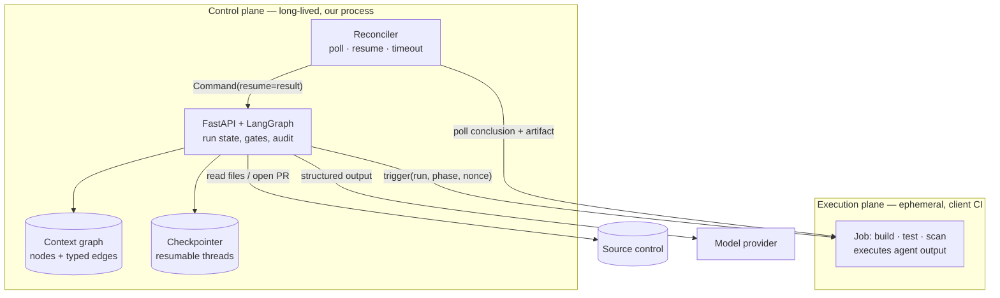
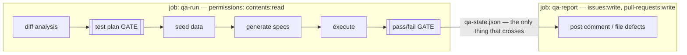
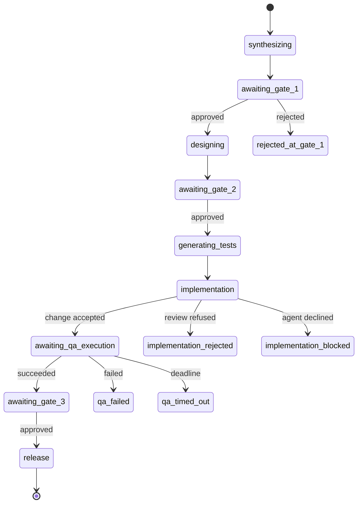
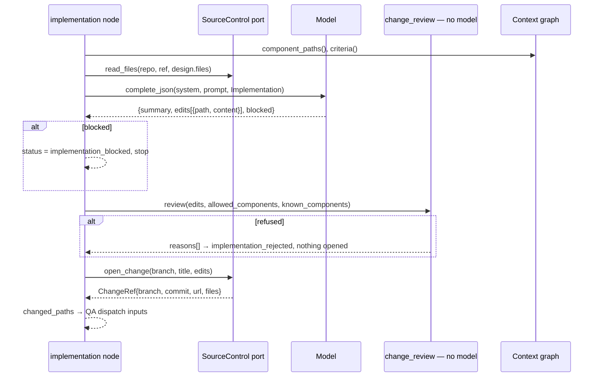
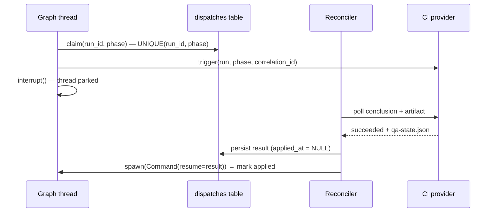
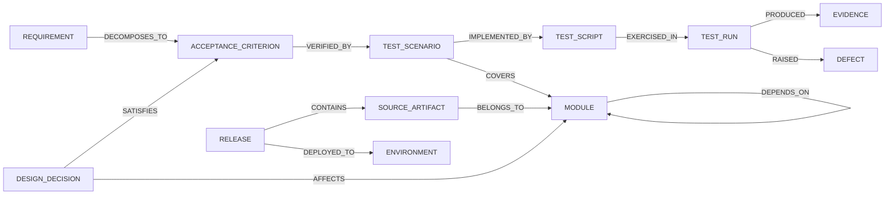
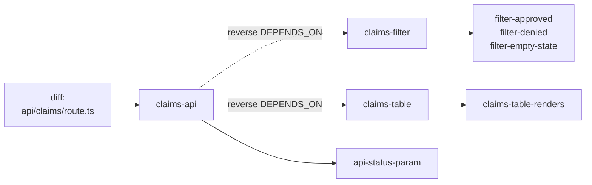
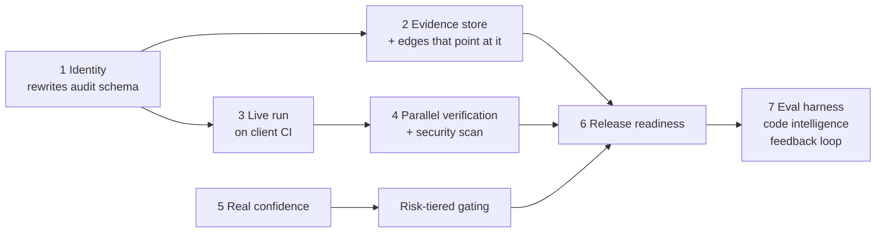

# Agentic SDLC Platform — Technical Briefing

> **For a PowerPoint generator.** `---` separates slides. `#` is the slide title.
> Fenced ```mermaid``` blocks are diagrams — render them to images, or paste into
> any mermaid-capable tool. Tables render as tables, fenced code as monospace.
> `**Notes:**` blocks are speaker notes, not slide content.
>
> 20 slides. Audience: CTO and engineering leadership. Assume they read code.

---

# Agentic SDLC Platform

## Deterministic governance around non-deterministic agents

- LangGraph state machine, 13-phase lifecycle, 6 running
- Control plane (FastAPI) decides; client CI executes
- 10 ports / 16 adapters; 247 tests, incl. architectural assertions
- One cycle proven: requirement → PR → scoped tests → release

---

# What actually breaks when you put an agent in a delivery path

| Property CI assumes | What an agent does | Consequence |
|---|---|---|
| Deterministic output | Same input, different output | Cannot diff, cannot replay, cannot regression-test the pipeline |
| Bounded blast radius | Edits whatever seems relevant | No containment; review burden scales with output |
| Explicit provenance | Reasoning is not an artifact | Cannot answer "why did this ship" |
| Failure is loud | Produces plausible wrong output | Failures are silent until expensive |

**Notes:** This is the technical framing, not a compliance one. Every mitigation
in this deck maps to one of these four rows. Row 4 is the dangerous one — a
pipeline that fails loudly is fine; one that ships a confident wrong answer is
not.

---

# System context



- **No inbound path required.** Results are pulled, never pushed
- Agent-authored code executes only in the execution plane

**Notes:** The absence of an inbound path is the deployment story: the control
plane sits behind a firewall and initiates everything. It also removes the
shared-secret problem — there is no callback signature to verify because
callbacks carry no data.

---

# Trust boundary — enforced by job topology, not by policy



| | qa-run | qa-report |
|---|---|---|
| Executes agent-generated code | **yes** | no |
| Holds a write token | **no** | yes |
| Runs `npm install` | yes | no |

**Notes:** The threat is concrete: PR diff → model → TypeScript → executed on a
runner holding a token. Splitting the job means the compromise path has no
credential at the end of it. This is structural — nobody has to remember it.

---

# Phase execution model



- **One interrupt site** in the codebase. Human pause and machine pause are the
  same mechanism with different resumers
- Every terminal state must be registered, or the SSE stream never closes

**Notes:** State lives in a checkpointer, not in the process — a paused run
survives restart and config change. The single-interrupt-site rule is what
makes "why did this stop" one readable code path instead of nine.

---

# Every phase has the same contract

```
propose  →  agent, constrained to a declared output schema
decide   →  deterministic predicate; no model in the call stack
record   →  audit pair + typed graph edges, stamped with the run
approve  →  human, at a tier set by risk
```

| Phase | Predicate that decides |
|---|---|
| test_plan | `expected_outcome` assertable ∧ `ac_ref` resolves ∧ `required_data` satisfiable |
| implementation | parses ∧ within named modules ∧ ¬forbidden path ∧ ≤25 files |
| qa gate | `assigned ≥ planned` ∧ `ran ≥ assigned` ∧ `∀ tests: status = expected` |
| release readiness | `∀ criteria: ∃ path(criterion → scenario → script → run[passed])` |

**Notes:** These are the actual predicates, not paraphrases. Row 4 is a graph
traversal — it is not derivable from a run log, which is the entire argument
for the context graph.

---

# Implementation phase — sequence



- Agent returns **whole files**, not diffs — a patch that fails to apply is a
  failure with no useful message
- `blocked` is a first-class outcome: "cannot be done by editing what you gave me"

**Notes:** Note the ordering — review happens before anything is written to
source control. A refused change leaves no branch, no PR, no artifact.

---

# Change review — the actual checks

| Check | Rule | Rationale |
|---|---|---|
| Containment | `component_of(path) ∈ design.modules` | Graph makes "what may this touch" checkable |
| Syntax | `ast.parse` for `.py`; build for TS | Catch unparseable before execution |
| Path safety | ¬`.github/workflows/`, ¬`.env`, ¬`../`, ¬absolute | Pipeline must not edit its own controls |
| Size | ≤25 files, ≤120 KB/file | Bounded review burden |
| Non-empty | `len(edits) > 0` | "No change" is a distinct outcome |

```python
verdict = review(edits,
                 allowed_components=design["modules"],
                 known_components=await graph.component_paths())
if not verdict.allowed:
    return {"status": "implementation_rejected", "reasons": verdict.reasons}
```

**Notes:** Containment is the row that matters and the row only the graph makes
possible. Without it, "the agent edited something it shouldn't have" is a code
review opinion rather than a build failure.

---

# Dispatch seam — async execution, three hazards



| Hazard | Mechanism | Guard |
|---|---|---|
| Duplicate job | Node re-executes from top on resume | `UNIQUE(run_id, phase)` — record before trigger |
| Result before park | `spawn_run` refuses busy thread | Persist first; reconciler retries next tick |
| Job never reports | No conclusion ever arrives | `deadline_at` → resume with `timed_out` |

**Notes:** Hazard 1 is the severe one. LangGraph re-executes a node's coroutine
from its start on resume, so everything before `interrupt()` runs twice — and
here that means launching a second CI job. The unique constraint makes it
impossible rather than unlikely.

---

# Context graph — ontology



- **15 node types, 16 edge types.** Each edge has a signature validated at write
- Fixed, not client-configurable — configurable semantics means no portable phase logic
- Clients extend via `x_`-prefixed types: stored, displayed, never gated on

**Notes:** Every edge carries `run_id` and `phase`. Append-only — superseded,
never rewritten. That is what makes it an audit record rather than a cache.

---

# Identity is derived, not allocated

```python
NAMESPACE = UUID("6f2a1c7e-9b3d-4a52-8f61-0c4d7e5a2b19")

def node_id(node_type: str, system: str, external_id: str) -> str:
    return str(uuid5(NAMESPACE, f"{node_type}|{system}|{external_id}"))
```

- Both planes compute the same id for the same thing **with no round trip**
- Ingest is idempotent for free — re-applying a result creates no duplicates
- Function is duplicated across two packages that cannot import each other;
  a test imports the other copy **by path** and asserts they agree

| Layer | Ownership |
|---|---|
| Ontology | Platform — fixed |
| Resolution (native id → node) | Adapter — per client system |
| Extension (`x_*`) | Client — stored, never gated on |

**Notes:** The duplication test exists because silent divergence is the worst
possible failure here: every cross-plane edge would point at a node that
doesn't exist, and nothing would error.

---

# Test scoping from the dependency graph



Measured, on the proven cycle:

| | Whole application | Scoped to change |
|---|---|---|
| Scenarios planned | 21 | **11** |
| Modules exercised | all | claims-filter, claims-table |
| Browser tests | ~40 | 12 |

- One-hop reverse traversal. Unbounded depth is the query that would justify a
  graph database — we do not have it yet

**Notes:** The diff touched the API only. Two modules it never touched were
still tested, because they depend on it. That is the difference between scoping
from a diff summary and scoping from a dependency graph.

---

# Ports — the integration surface

```python
class WorkDispatch(Protocol):
    async def trigger(self, run_id, phase, correlation_id, inputs) -> DispatchHandle
    async def check(self, handle) -> DispatchResult   # pending|succeeded|failed|timed_out

class SourceControl(Protocol):
    async def read_files(self, repo, ref, paths) -> dict[str, str]
    async def open_change(self, repo, base_ref, branch, title, body, edits) -> ChangeRef

class CodeIntelligence(Protocol):
    async def index(self, repo, ref) -> CodeIndex     # modules, files, dependencies

class EntityResolver(Protocol):
    async def resolve(self, node_type, system, external_id, projection) -> NodeRef
```

- 10 ports, 16 adapters, selection by config at runtime
- Adapter construction uses **lazy import per branch** — required for the purity
  assertions to hold

**Notes:** `open_change` proposes; there is no merge method. What happens to a
change is the client's existing review process, and a platform that merged its
own work would be asking to be switched off.

---

# Adapter matrix

| Port | Today | Client-facing options |
|---|---|---|
| LLMProvider | Claude direct, deterministic mock | Bedrock, Vertex, Foundry |
| WorkDispatch | GitHub Actions, local pipeline, stub | Jenkins, ADO Pipelines |
| SourceControl | GitHub (Git Data API), local worktree | GitLab, Bitbucket, ADO Repos |
| CodeIntelligence | GitHub archive, local path | GitLab, language server |
| AuditSink | SQLite | Postgres, Splunk, Sentinel |
| RequirementsSource | text/CSV | Jira, ADO, Confluence |
| TestManagement | JSON file | Zephyr, TestRail, qTest, Xray |

- **Every port has an offline default.** Whole system runs with no keys, no network

**Notes:** The offline defaults are not a demo convenience — they are how the
test suite runs deterministically, and how a client evaluates without
provisioning anything.

---

# Architecture enforced by tests, not documentation

```python
# 29 assertions of this shape, each in a clean subprocess
subprocess.run([sys.executable, "-c",
    f"import {module}; import sys;"
    f"assert 'anthropic' not in sys.modules"])
```

| Assertion | Prevents |
|---|---|
| No core/port/agent module imports a model client | Gate logic reaching a model |
| Only `adapters/` may import `httpx` | Core becoming provider-shaped |
| Importing core pulls in no concrete adapter | Config-driven selection degrading to imports |
| Both planes' `node_id` agree | Silent cross-plane identity divergence |

**Notes:** Every one of these boundaries is one hurried afternoon from being
crossed. A comment does not fail a build. This is the single highest-leverage
thing in the codebase for surviving a delivery team.

---

# Failure modes and disposition

| Failure | Detection | Disposition |
|---|---|---|
| Agent proposes untestable scenario | testability gate | Feedback + revise, ≤3 attempts, then stop |
| Agent edits outside design | change review | Refuse; nothing written to SCM |
| Agent cannot satisfy criteria | self-reported `blocked` | Stop; no speculative change |
| Generated spec unsafe | static allowlist | Never written; gate fails on assignment count |
| CI job never reports | `deadline_at` | Resume with `timed_out`, terminal |
| Result arrives before park | `applied_at` NULL | Queue; reconciler retries |
| Model refuses | `stop_reason == refusal` | Server-side fallback, else raise |
| Node transient failure | retry wrapper | ≤N retries, then template fallback |
| **Gate or dispatch node** | — | **Never retried, never fallen back** |

**Notes:** Last row is deliberate. A paused node is not a transient failure —
falling back would mean recording an approval nobody gave, or a verdict no test
produced. That is precisely the failure this system exists to prevent.

---

# Data model

| Store | Cardinality | Key property |
|---|---|---|
| `runs` | 1 per run | id == LangGraph thread id |
| `audit_log` | 2 per node call | Exactly one before/after pair regardless of retries |
| `dispatches` | 1 per (run, phase) | `UNIQUE` = idempotency guard + result queue + timeout ledger |
| `graph_nodes` | 1 per real-world entity | Derived id; projection only, never content |
| `graph_edges` | append-only | Carries `run_id`, `phase`; superseded, never deleted |
| `checkpoints` | 1 per thread | Separate store — resumption ≠ audit |

- Checkpoint and audit are deliberately separate: conflating them makes the
  audit trail depend on a serialization format

**Notes:** The `dispatches` row doing three jobs is not overloading — all three
hazards are the same row's lifecycle, and splitting them would need a
distributed transaction to keep consistent.

---

# Current state

| Phase | State | | Phase | State |
|---|---|---|---|---|
| intake | stub | | non-functional | absent |
| requirements | stub | | data / migration | absent |
| architecture | partial | | release readiness | partial |
| **implementation** | **real** | | **deploy** | **partial** |
| code review | absent | | post-deploy | absent |
| security | absent | | operate | absent |
| **functional QA** | **real** | | | |

| Suite | Tests |
|---|---|
| Architecture purity | 29 |
| Implementation phase | 19 |
| Dispatch seam | 12 |
| Context graph, settings, runtime | ~77 |
| Execution plane | 110 |
| **Total** | **247** |

**Notes:** 6 of 13 running. Do not soften it — proving one vertical slice
establishes the architecture; the rest is the same four-part shape repeated.

---

# Roadmap — dependency-ordered



| Known gap | Consequence today |
|---|---|
| No authentication | Approvals not attributable — blocks any regulated client |
| Confidence is a constant | Risk tiering cannot be enabled |
| Verification is sequential | Adding 3 phases serialises them for no reason |
| Evidence expires with CI run | Edges point at artifacts that vanish |

**Notes:** 1 and 2 are unglamorous and non-negotiable — both rewrite storage, so
they must precede runs worth keeping. 5 gates 4's usefulness: policy routing on
a constant is worse than no policy.

---

# Asks

| Ask | Decision needed |
|---|---|
| Endorse the plane split | Control plane decides; client CI executes |
| Fund next slice | Identity + evidence store + one live client CI run |
| Name pilot client + repo | Platform connects to an existing repo unmodified |
| Set IP boundary | What is open, what is proprietary |

**Open technical questions**

- Graph database threshold: at what traversal depth does Postgres stop being
  adequate?
- Model tenancy: client-hosted (Bedrock/Vertex) vs ours — affects data residency
- Whether code review is a phase or a property of implementation

**Notes:** The three open questions are the ones worth an architect's time in
the room. The graph-database one is genuinely undecided and depends on whether
impact analysis becomes the product.
