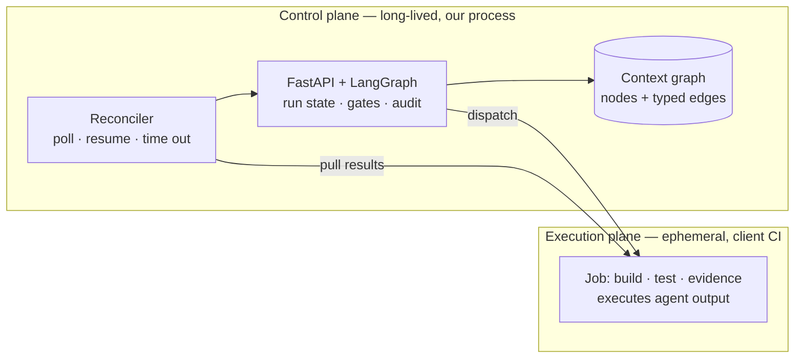
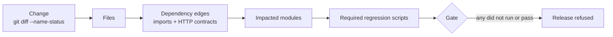
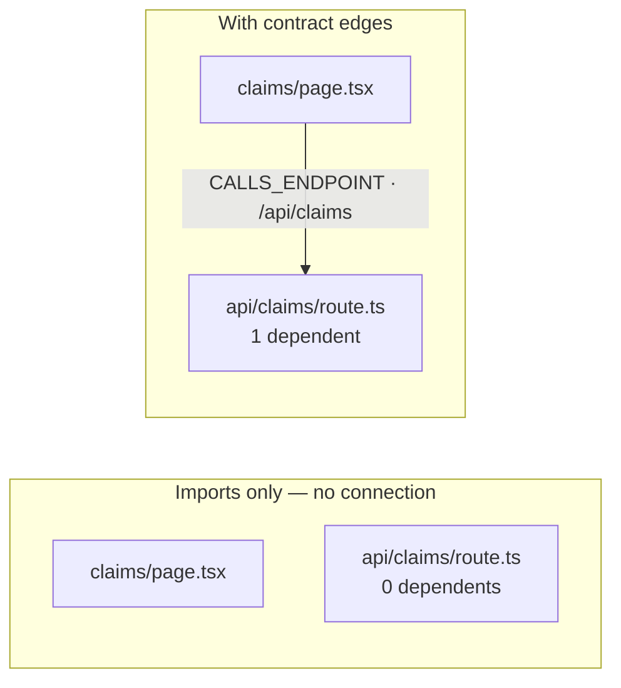
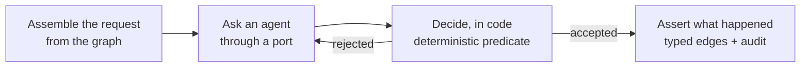
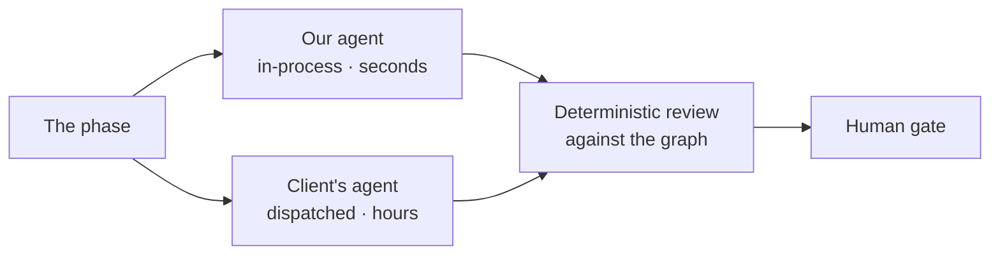

# Agentic SDLC Platform — Technical Briefing

> **For a PowerPoint generator.** `---` separates slides. `#` is the slide title.
> Fenced `mermaid` blocks are diagrams — render them to images, or paste into
> any mermaid-capable tool. Tables render as tables, fenced code as monospace.
> `**Notes:**` blocks are speaker notes, not slide content.
>
> 22 slides, two audiences. Slides 1–11 are the argument and the evidence, and
> stand alone for leadership — stop there and the case is complete. Slides 12–18
> are the mechanism, for the team. Slides 19–22 close for both.

---

# Agentic SDLC Platform

## Deterministic governance around non-deterministic agents

- Agents propose. Deterministic code decides. Humans approve what carries risk.
- Control plane owns the decisions and the evidence; the client's CI does the work
- 11 ports / 18 adapters · 583 tests · one cycle proven end to end
- **New since last review:** we measured our own controls, and three of them were not working

**Notes:** Lead with the last bullet. The interesting development this quarter is
not another phase — it is that we stopped asserting the blast radius was good and
built something that measures it. That measurement then failed several of our own
claims, which is the reason to believe the remaining ones.

---

# What breaks when you put an agent in a delivery path

| Property CI assumes | What an agent does | Consequence |
|---|---|---|
| Deterministic output | Same input, different output | Cannot diff, cannot replay, cannot regression-test the pipeline |
| Bounded blast radius | Edits whatever seems relevant | No containment; review burden scales with output |
| Explicit provenance | Reasoning is not an artifact | Cannot answer "why did this ship" |
| Failure is loud | Produces plausible wrong output | Failures are silent until they are expensive |

**Notes:** Every mitigation in this deck maps to one of these four rows. Row 4 is
the dangerous one — a pipeline that fails loudly is fine; one that ships a
confident wrong answer is not. Row 2 is the one this deck spends most of its time
on, because it is the one we can now put a number against.

---

# The governing principle

> **No model is ever in a position to approve its own work.**
> Every yes/no decision is made by code you can read, or by a person whose
> identity is recorded.

This holds whoever supplied the agent — and holds a client's agent *more* strictly,
because it is the only one that can change without us knowing.

**Notes:** This is the sentence to repeat if you only get one. Everything else is
an implementation detail of it.

---

# Where it runs



- The control plane never executes agent-authored code
- Results are **pulled**, never pushed — no callback to authenticate, no secret to rotate
- One seam now carries three kinds of remote work: CI, a client's coding agent, a client's test agent

**Notes:** The pull direction is worth a sentence. A pushed result needs a signed
callback and a rotating secret; a pulled one needs neither, and a forged result
cannot become run state because nothing outside the reconciler can write to it.

---

# Blast radius — the core claim

A change is admissible only within the scope a human approved, and testing is
scoped to what that change can actually reach.



Everything on this path is deterministic. No model participates in any of it.

**Notes:** This is the architecture's central bet: that "what can this change
break" is answerable by code rather than by judgement. Which is exactly why it
needed measuring — an unmeasured central bet is a slogan.

---

# So: is the blast radius any good?

Held-out testing over real commits. One file removed per commit; does the graph
reach the files it was changed alongside?

| Predictor | Recall | Precision | Files predicted |
|---|---|---|---|
| Graph, imports + contracts · **depth 2** | **14.4%** | **21.1%** | **6.7** |
| Graph · depth 1 | 10.7% | 29.1% | 3.5 |
| Baseline: same directory | 14.6% | 15.3% | 15.0 |
| Baseline: whole repository | 100% | 5.4% | 211 |

**At depth 2 we match "just look in the same folder" on recall, with 1.4× the
precision and 45% of the noise.** That is the honest size of the win.

**Notes:** Two baselines make this readable. "Whole repository" is the recall
ceiling — trivially perfect, useless. "Same directory" is what you get with no
dependency analysis at all, and it is the bar worth clearing. Do not oversell
14.4%; the value is precision at a fraction of the review burden, and the number
is a floor from a small corpus.

---

# What the measurement told us that argument had not

| We believed | Measurement said | We changed |
|---|---|---|
| One hop is the right depth | One hop scored **below** the do-nothing baseline | Default moved to two, with the table in the code |
| The dependency edges cannot be wrong | 19 internal edges were being dropped silently | Four honest buckets; capture rate now **99.3%** |
| The QA plane scoped by a derived graph | It read a hand-authored file | Generated export, pinned to a commit |
| Test scripts covered what they claimed | Every claim was wrong — they covered *more* | Coverage observed from run traces |

**Notes:** This is the credibility slide. Do not skip it, and do not soften it.
Four claims we had made in a previous version of this deck turned out to be
false, and we found them by building the thing that checks. That is the argument
for trusting the numbers we are quoting now.

---

# The blind spot worth naming

A dependency graph built from imports cannot see an HTTP call. The frontend and
the API import nothing from one another.



- On a sibling repository: **zero edges** between web and api while five web files called it
- Every route handler in our own repo had **zero dependents** before this
- Recovered by matching a declared route to a literal in a call — both statically visible
- A URL assembled at runtime still cannot be matched; those are **counted, not guessed**

**Notes:** If someone asks what the platform still cannot see, this is the honest
answer and the counter is in the seed output. Contract edges improve recall at
every traversal depth, and the gap widens the deeper you go — which is what you
would expect from an edge that crosses a service boundary.

---

# Test selection: required, not suggested

**Before:** impacted modules were interpolated into a prompt as "worth reusing as
regression". Nothing verified the result. An agent could omit every one and the
run still passed.

**Now:** scripts covering an impacted module are installed **by code**, and the gate
enforces:

```
required ⊆ ran   ∧   every required script passed
coverage a script claims  ⊆  what the run was observed to exercise
```

Change to `app/api/claims/route.ts` → impacts 2 modules → **3 scripts required** →
any failing or missing fails the release.

**Notes:** The second line is the one that catches drift: a script that passed
while never requesting the module it is credited with is a coverage record a gate
would otherwise trust.

---

# Coverage is observed, not declared

Playwright already records a trace per test. Read it afterwards and you know what
each test actually requested.

- No changes to the tests — a spec may only import the test framework, and a
  fixture there would weaken the sandbox that contains generated code
- A test that **intercepts** a request never reaches the handler, so it earns no
  coverage. Crediting it would write a claim no future run could disprove
- Reported at **file** level, because module level hides the truth: a module reads
  as covered the moment any page test runs its layout

**Notes:** When we turned this on, it immediately contradicted a coverage table we
had hand-written an hour earlier — every script covered more than it claimed. The
mechanism earns its place by being able to disagree with us.

---

# The mutation that makes the case

We broke the claims API's status filter — made it case-sensitive.

| Test | Result |
|---|---|
| Claims list renders | ✅ passed |
| Filter behaviour (3 tests) | ✅ passed |
| **API contract test** | ❌ **failed** |

**Every page-level test passed.** The page sends the exact string, so nothing it
does is affected. Without the contract test, the run is green and a breaking
change ships for every other caller.

**Notes:** This is the single most persuasive slide for a sceptical engineer. It
is not a hypothetical — we introduced the bug deliberately and this is what
happened. It is also exactly the failure mode the blast-radius argument exists
for: the damage is not where you changed the code.

---

# Every phase has the same contract



- The request is assembled **by the phase**, never fetched by the agent — so an
  agent cannot quietly widen what it looks at
- Rejection reasons go back for a bounded number of attempts
- Evidence is a byproduct of gating; there is no separate collection step that
  could disagree with what happened

---

# The gate that does the containment

`review_change` — plain code, no model:

| Check | Refuses |
|---|---|
| Path escapes the repository | `../` or absolute |
| Forbidden target | CI workflows, `.env`, keys, `node_modules` |
| Python does not parse | Syntax error, with line number |
| Too large | >25 files, >120 KB per file |
| **Outside the approved modules** | An edit the design never named |
| **Unattributable path** | A file the graph cannot place — *fails closed* |

**Notes:** The last row is a bug we shipped and then found. An unmapped path used
to be dropped from the set being checked, so a change made *entirely* of
unmappable paths skipped containment altogether and was allowed. We demonstrated
it before fixing it.

---

# Client agents — the same review, a different guarantee

A client with their own coding agent can substitute it. That is a config change,
not a fork.



| | Our agent | Client's cloud agent |
|---|---|---|
| Returns | Edits | Its own pull request |
| Out-of-scope change is | **Prevented** — never reaches a branch | **Detected** — branch exists, run fails |

**Notes:** Be precise about the right-hand column. We cannot stop an agent that
runs in someone else's environment from writing. We can refuse to let it proceed,
and we say so rather than implying a control we do not have. This is also why the
design gate matters *more* when a client agent implements: a human bounds the
scope before the work starts.

---

# Ports — the integration surface

| Port | Answers | Client adapters |
|---|---|---|
| `RequirementsSource` | Where work arrives | Jira, ADO, Confluence |
| `CodeIntelligence` | What depends on what | GitHub, GitLab, language server |
| `DesignAgent` | What a change should touch | Ours, or the client's |
| `SourceControl` | Where a change is proposed | GitHub, GitLab, Bitbucket, ADO |
| `WorkDispatch` | How a phase runs elsewhere | Actions, Jenkins, ADO, Copilot |
| `TestAuthor` | What to test, and the spec | Ours, or the client's |
| `TestManagement` | Where test cases live | Zephyr, TestRail, qTest, Xray |
| `AuditSink` | Who did what, when | Postgres, Splunk, Sentinel |

11 ports, 18 adapters. Phase logic only ever sees the interface.

---

# The boundary is enforced by tests, not by discipline

Three assertions, each a build failure:

```
no core module may import a model client
only an adapter may speak HTTP
importing the core must not pull any integration into memory
```

Each runs in a clean subprocess, because import side effects are the thing being
asserted about.

**It caught a real regression during this work:** a router acquired an `httpx`
import to catch a transport error. Transport belongs to the adapter that speaks
it — the test failed the build and the adapter now wraps its own.

**Notes:** Pluggability always erodes under pressure. This is the difference
between a principle and a code review conversation.

---

# One deployment, several clients

Indexing a second repository used to **delete the first** — silently. No error;
the first team's next design phase simply refused against an empty graph.

- Project scope lives in node **identity**, so two clients' identical file paths
  are distinct without a migration
- Every reader is scoped, not only the destructive paths — an unscoped impact
  query would tell one client their change reaches another client's code
- Runs record the project they started under, so the trail survives a switch
- **Not included:** authentication and membership. Projects contain data; they do
  not control who sees it

---

# Configuration cannot break the platform

Selecting an integration through the console once **bricked the deployment** —
the value was stored before anything checked it could be built, and the process
would not restart.

| Control | Guarantees |
|---|---|
| Built in full before stored | Refused with the reason; nothing written |
| Preflight endpoint | The console says what a choice needs *while choosing* |
| Three startup fallbacks | Ends in every integration disabled — it always comes up |
| Read-only reachability check | Verifies a client agent without starting billable work |

Enforced exhaustively: every option of every selector, and all 48 combinations.

**Notes:** Worth a beat for leadership. This is the class of bug that turns a
demo into an incident, and the fix is structural rather than a fixed instance.

---

# Current state

| Phase | State |
|---|---|
| Intake · Requirements | Stub — port in place, no parsing intelligence |
| **Design** | Real — validated against the graph, fails closed |
| Test cases | Partial — recorded through the port |
| **Implementation** | Real — ours or a client's agent, both reviewed |
| **QA dispatch** | Real — real CI, real revision pair, pulled results |
| **Test plan · generation · execution** | Real — behind ports, sandboxed, enforced |
| **Evidence · release gate** | Real — traces, observed coverage, required regressions |
| Release | Partial — records what shipped; deploy is a no-op adapter |

583 tests. One cycle proven end to end against a live model and a real application.

---

# What it does not do

| Gap | Consequence |
|---|---|
| No symbol-level analysis | A private helper and a breaking API change have the same radius |
| Module = truncated directory | Repository layout, not architecture |
| Coverage is route-level | Tells you a module was never requested; not which branch ran |
| Accuracy corpus is our own repo | 240 cases, one codebase. A regression detector, not an industry claim |
| No per-scenario data isolation | Mitigated by serialising and detecting, not solved |
| Copilot adapter unproven live | Built to the published API; no task started against a real repo |

**Notes:** Put this slide in front of the sceptic before they ask. Every one of
these is a known limit with a decided position, which reads very differently from
a gap someone discovers in a POC.

---

# Roadmap — ordered by what changes the argument

1. **Run the accuracy harness against a client history** — every impact number
   today comes from one repository of large commits, the worst case for the signal
2. **Symbol-level indexing** — separates "a file changed" from "an exported
   signature changed"; the harness decides whether it earns its cost
3. **Identity and access** — approvals attributable to a named person; projects
   that control access rather than only containing data
4. **Requirements and test management through their ports** — the last place the
   pipeline reads a file it should have been given
5. **Per-scenario data isolation** — fixtures per test, or a per-worker store

**Notes:** Item 1 is cheap and changes what we are allowed to claim. Item 2 is the
expensive one, and we are deliberately not starting it until item 1 says where
recall is actually leaking.

---

# Asks

**A client repository and its history.** The single highest-value input. It turns
our accuracy number from a self-measurement into evidence, and costs the client
nothing but read access.

**A decision on the identity provider.** Access control is the one enterprise gap
we will not close by guessing, and it rewrites the audit schema — so it is
cheaper now than later.

**One engagement willing to run a real change through it.** Everything here is
proven on an application we control. The next honest step is one we do not.

**Notes:** Keep the asks concrete and small. We are not asking for a platform
decision — we are asking for read access to a repository, one architectural
answer, and one candidate change.
